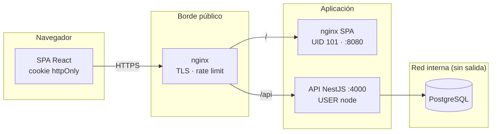
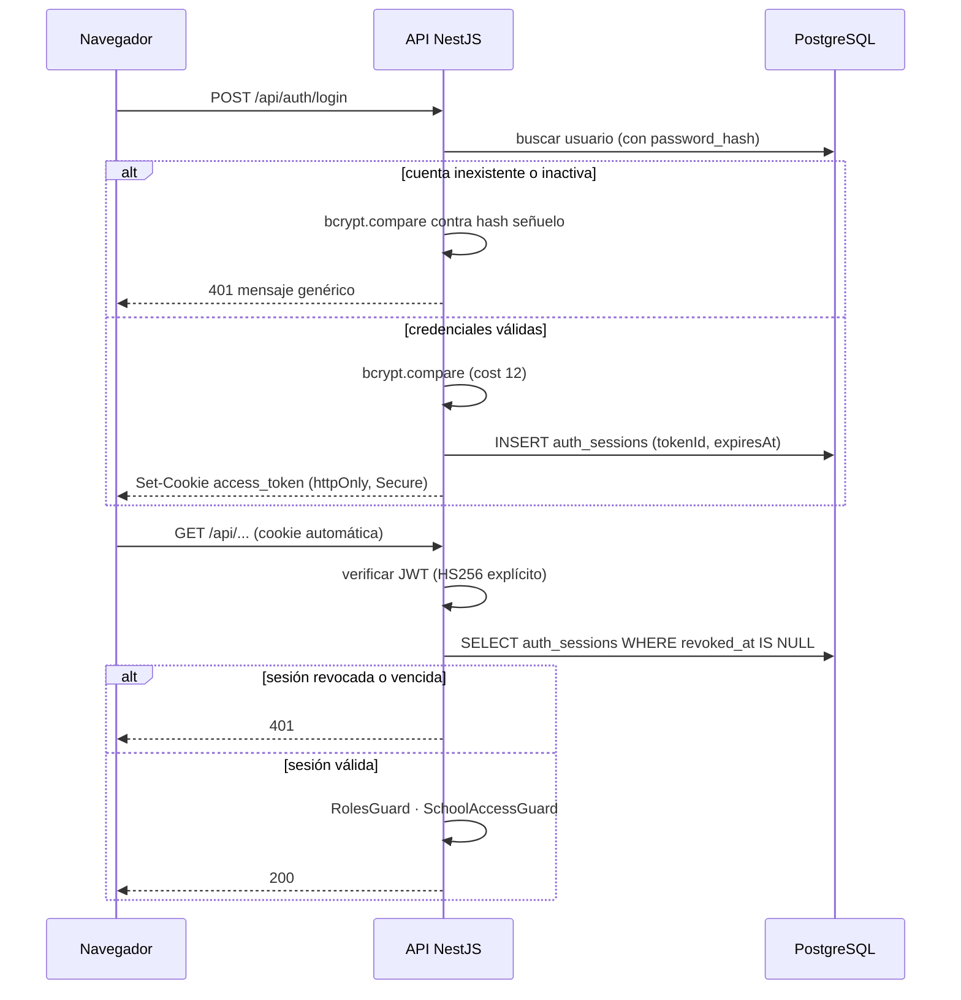
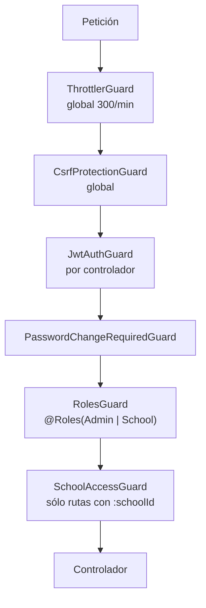
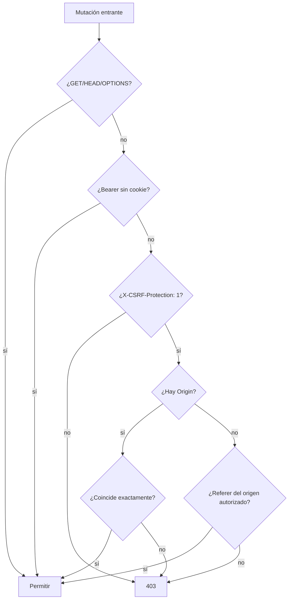

# Arquitectura de seguridad

Descripción de los mecanismos de seguridad tal como están implementados, con la
ubicación exacta en el código. Complementa `THREAT_MODEL.md` (qué puede salir
mal) y `SECURITY_CONTROLS.md` (catálogo de controles).

| Campo | Valor |
| --- | --- |
| Fecha | 2026-08-28 |
| Backend | NestJS 11 · TypeScript 5.7 · Node 22 · PostgreSQL 17 |
| Frontend | React 19 · Vite 8 · TypeScript 6 |

---

## 1. Topología

**Principio rector:** un único punto de entrada público. La API y la base nunca
publican puertos; sólo son alcanzables dentro de la red de Docker.

---

## 2. Cadena de autenticación

### Decisiones y su porqué

| Decisión | Ubicación | Motivo |
| --- | --- | --- |
| JWT en cookie `httpOnly` y no en `localStorage` | `auth.controller.ts:107-126` | JavaScript no puede leerla: un XSS no roba la sesión |
| Sesión con estado en base | `auth.service.ts:132-153` | Permite revocación real. Un JWT puro sería válido hasta expirar aunque el usuario cierre sesión |
| `algorithms: ['HS256']` explícito | `jwt.strategy.ts` | Sin lista blanca se acepta el algoritmo del header del token |
| Rol leído de la base en cada petición | `auth.service.ts:154-163` | Un cambio de rol surte efecto de inmediato; el rol del payload no se usa para autorizar |
| bcrypt señuelo cuando la cuenta no existe | `auth.service.ts` | Iguala el tiempo de respuesta y evita enumerar usuarios |

---

## 3. Autorización en capas

Los dos primeros son globales (`app.module.ts`). Los tres siguientes se declaran
a nivel de clase en **los 18 controladores**; el último se aplica en las rutas
que reciben un identificador de establecimiento.

| Guard | Qué impide |
| --- | --- |
| `ThrottlerGuard` | Automatización y fuerza bruta |
| `CsrfProtectionGuard` | Mutaciones disparadas desde otro sitio |
| `JwtAuthGuard` | Acceso sin sesión válida |
| `PasswordChangeRequiredGuard` | Operar sin cambiar la contraseña inicial |
| `RolesGuard` | Escalación vertical entre roles |
| `SchoolAccessGuard` | Escalación horizontal entre escuelas (IDOR) |

---

## 4. Defensa anti-CSRF

La cookie `httpOnly` protege del robo por XSS, pero el navegador la adjunta
automáticamente: eso **habilita** CSRF. La defensa es doble
(`csrf-protection.guard.ts`):

Por qué funciona:

1. Un formulario cross-site **no puede** agregar cabeceras personalizadas.
2. Un `fetch` cross-site que lo intente dispara un preflight CORS, que la API
   rechaza porque sólo admite un origen.
3. Los clientes que sólo usan `Bearer` no son vulnerables: el navegador no
   adjunta esa cabecera por su cuenta.
4. La ausencia de `Origin` ya no basta: exige un `Referer` del origen
   autorizado (hallazgo H-02).

Verificado por 6 tests en `test/security-access-control.e2e-spec.ts`.

---

## 5. Datos en reposo y en tránsito

| Dato | Protección |
| --- | --- |
| Contraseñas | bcrypt cost 12, columna con `select: false` |
| Tokens de recuperación | SHA-256 en base; el valor original sólo viaja por correo |
| JWT | Firmado HS256 con secreto de entorno; nunca en `localStorage` |
| Conexión a la base | Red interna de Docker, sin exposición |
| Correo saliente | `requireTLS: true` fuera del puerto 465 |
| Tráfico del cliente | TLS terminado en el reverse proxy |

---

## 6. Aislamiento de contenedores

| Control | Backend | Frontend |
| --- | --- | --- |
| Multi-stage build | Sí | Sí |
| Usuario no-root | `USER node` | UID 101 (`nginx-unprivileged`) |
| `NODE_ENV=production` | Sí | Build de producción |
| `HEALTHCHECK` | Sí | Sí |
| `read_only` | Sí + tmpfs | Sí + tmpfs |
| `cap_drop: ALL` | Sí | Sí |
| `no-new-privileges` | Sí | Sí |
| Puertos publicados | Ninguno | Ninguno |
| Imagen base con versión fija | `node:22-alpine` | `nginx-unprivileged:1.29.3-alpine` |

Verificado con `docker inspect` sobre el entorno en ejecución, no sólo
declarado en el compose.

---

## 7. Configuración y secretos

`config/env.validation.ts` se ejecuta al arrancar y **detiene el proceso** si
falta `JWT_SECRET`, `JWT_EXPIRES_IN`, `FRONTEND_URL` o el bloque de base de
datos. También exige que la configuración SMTP esté completa o totalmente
vacía, evitando estados a medias.

| Variable | Naturaleza |
| --- | --- |
| `JWT_SECRET` | Secreto — sólo por entorno |
| `POSTGRES_PASSWORD` / `DATABASE_PASSWORD` | Secreto |
| `SMTP_USER` / `SMTP_PASSWORD` | Secreto |
| `FRONTEND_URL` | Público — define el origen de CORS y CSRF |
| `VITE_*` | **Público** — queda incrustado en el bundle |

Toda variable `VITE_*` es visible para cualquier visitante. El workflow del
frontend falla si aparece una credencial o un source map en `dist/`.

---

## 8. Diferencias entre el entorno de CI y producción

| Aspecto | Entorno efímero | Producción |
| --- | --- | --- |
| TLS | No (HTTP) | Sí, en el reverse proxy |
| Cookie `Secure` | Se emite igual | Efectiva |
| DAST autenticado | Bearer | Cookie |
| Datos | Sintéticos | Reales |
| SMTP | Sin configurar | Servidor institucional |
| CSP de la SPA | Ausente (proxy transparente) | La aporta el reverse proxy |

El proxy del entorno de pruebas es **transparente a propósito**: no agrega
cabeceras de seguridad para que el DAST mida lo que entrega la aplicación y no
lo que aporta la infraestructura de pruebas.
