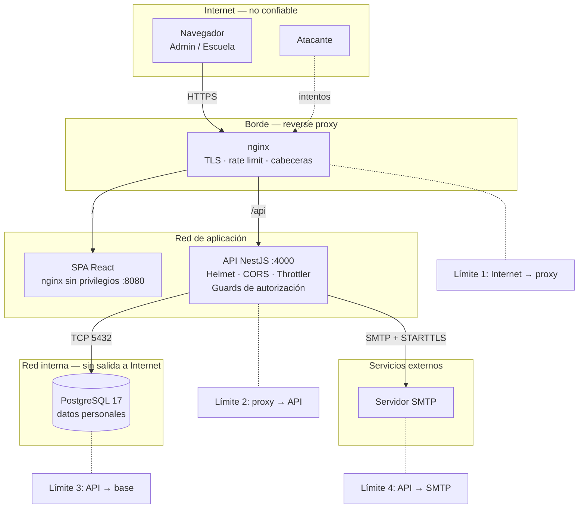

# Modelo de amenazas

Metodología STRIDE aplicada a la arquitectura **realmente presente en el
código**. No se incluyen integraciones que el proyecto no tiene: no hay
pasarelas de pago, ni colas, ni almacenamiento de objetos, ni proveedores de
identidad externos.

| Campo | Valor |
| --- | --- |
| Versión | 1.0 |
| Fecha | 2026-08-28 |
| Alcance | `mendoza-escuela/backend` y `mendoza-escuela/frontend` |
| Referencia | OWASP ASVS 5.0 L2, STRIDE |

---

## 1. Arquitectura y límites de confianza

### Límites de confianza

| # | Límite | Control principal |
| --- | --- | --- |
| 1 | Internet → proxy | TLS, rate limiting de red, cabeceras de seguridad, único puerto público |
| 2 | Proxy → API | CORS de origen único, guard anti-CSRF, `TRUST_PROXY_HOPS` para no confiar en `X-Forwarded-For` falsificado |
| 3 | API → PostgreSQL | Red `internal: true` sin salida a Internet, sin puertos publicados, credenciales por entorno, consultas parametrizadas |
| 4 | API → SMTP | Credenciales por entorno, `requireTLS` en el puerto 587, destinatario nunca tomado de entrada libre |

---

## 2. Activos

| Activo | Sensibilidad | Dónde vive | Impacto si se compromete |
| --- | --- | --- | --- |
| Credenciales de usuario | Alta | `users.password_hash` (bcrypt cost 12, `select: false`) | Suplantación de administradores provinciales |
| JWT de sesión | Alta | Cookie `httpOnly` del navegador + tabla `auth_sessions` | Acceso completo con la identidad de la víctima |
| Datos de establecimientos | Media-alta | Tablas `schools`, `user_schools` | Exposición de datos de instituciones educativas |
| Respuestas de cuestionarios | Media-alta | `submissions`, `answers` | Distorsión de resultados; datos institucionales sensibles |
| Resultados y evaluaciones | Media | `evaluation_*` | Decisiones de política pública basadas en datos alterados |
| Datos personales de referentes | Alta | `schools.referent_*`, `users` | Ley 25.326 de Protección de Datos Personales (Argentina) |
| Reportes PDF/Excel | Media | Generados on-the-fly, no persistidos | Filtración agregada de datos de múltiples escuelas |
| Correos salientes | Media | Nodemailer → SMTP | Contraseñas temporales y enlaces de recuperación |
| Secretos de configuración | Crítica | `JWT_SECRET`, credenciales de base y SMTP | Compromiso total del sistema |
| Registro de auditoría | Media | `audit_log` | Pérdida de trazabilidad ante una investigación |

---

## 3. Análisis STRIDE

### S — Suplantación de identidad (Spoofing)

| Amenaza | Control existente | Riesgo residual |
| --- | --- | --- |
| Fuerza bruta sobre el login | Bloqueo a los 5 intentos por 15 min + `@Throttle(10/min)` + límite en nginx | **Bajo** |
| Robo del JWT por XSS | Cookie `httpOnly`: JavaScript no puede leerla. React sin `dangerouslySetInnerHTML` | **Bajo** |
| Falsificación de token | HS256 con lista blanca explícita de algoritmos (H-01 corregido). Verificado por test: firma alterada y `alg: none` se rechazan | **Muy bajo** |
| Reutilización de token tras logout | Sesión validada contra `auth_sessions` en **cada** petición; logout marca `revoked_at` | **Muy bajo** |
| Enumeración de usuarios | Mensaje unificado y comparación bcrypt señuelo de tiempo constante (H-06 corregido) | **Bajo** |
| Suplantación por correo de recuperación | Token de 256 bits, hasheado SHA-256, uso único con lock pesimista, expiración de 30 min | **Bajo** |

### T — Manipulación de datos (Tampering)

| Amenaza | Control existente | Riesgo residual |
| --- | --- | --- |
| Inyección SQL | TypeORM con parámetros; auditados los 6 puntos de interpolación (sólo identificadores estáticos). Test dedicado | **Muy bajo** |
| CSRF sobre mutaciones | Cabecera personalizada + validación estricta de `Origin`, con `Referer` como respaldo (H-02 corregido). 6 tests | **Bajo** |
| Mass assignment | `whitelist` + `forbidNonWhitelisted` en el `ValidationPipe` global | **Muy bajo** |
| Formula injection en exportaciones | `spreadsheetSafeCell()` en todos los exportadores XLSX y CSV (corregido el padrón de escuelas) | **Bajo** |
| Carga de archivos maliciosos | Límite de tamaño, un solo archivo, filtro de MIME y extensión, sin escritura a disco | **Bajo** |
| Manipulación de cabeceras de proxy | `TRUST_PROXY_HOPS` fija la cantidad exacta de saltos confiables | **Bajo** |

### R — Repudio (Repudiation)

| Amenaza | Control existente | Riesgo residual |
| --- | --- | --- |
| Negar una acción administrativa | `audit_log` en campañas y evaluación | **Medio** — no cubre gestión de usuarios ni inicios de sesión |
| Ausencia de trazabilidad de accesos | `users.last_login_at`, tabla de sesiones | **Medio** |

> **Brecha reconocida:** ampliar la auditoría a altas y bajas de usuarios,
> cambios de rol y eventos de autenticación. Ver `SECURITY_CONTROLS.md`.

### I — Divulgación de información (Information Disclosure)

| Amenaza | Control existente | Riesgo residual |
| --- | --- | --- |
| Exposición de hashes de contraseña | `select: false` en la entidad | **Muy bajo** |
| IDOR entre escuelas | `SchoolAccessGuard` valida la asociación `user_schools`. 4 tests de acceso horizontal | **Bajo** |
| Secretos en el bundle del frontend | Ninguna variable `VITE_*` contiene secretos; el workflow falla si aparece una credencial o un source map | **Muy bajo** |
| Secretos en el historial Git | Gitleaks sobre el historial completo en cada PR | **Bajo** |
| Fuga por mensajes de error | Excepciones tipadas de Nest; sin stack traces al cliente | **Bajo** |
| Datos de otras escuelas en reportes | Los endpoints de escuela filtran por asignación | **Bajo** |
| Cabeceras que revelan tecnología | Helmet elimina `X-Powered-By`; `server_tokens off` en nginx | **Muy bajo** |

### D — Denegación de servicio (Denial of Service)

| Amenaza | Control existente | Riesgo residual |
| --- | --- | --- |
| Inundación de peticiones | Throttler global (300/min) + `limit_req` en nginx | **Medio** — sin protección anti-DDoS de capa de red |
| Agotamiento de memoria por importación | Límite de 2-5 MB y `SURVEY_IMPORT_MAX_ROWS` | **Medio** — el parseo ocurre en memoria; un XLSX muy comprimido sigue siendo un vector |
| Generación masiva de PDF/Excel | Sólo para usuarios autenticados; throttler global | **Medio** — operaciones sincrónicas y costosas, sin cola |
| Agotamiento de conexiones a la base | Pool por defecto de TypeORM | **Medio** |

> **Riesgo residual aceptado:** la aplicación no tiene protección de capa de red
> contra DDoS. Corresponde a la infraestructura provincial, no al código.

### E — Elevación de privilegios (Elevation of Privilege)

| Amenaza | Control existente | Riesgo residual |
| --- | --- | --- |
| Escuela accede a endpoints de admin | `RolesGuard` con `@Roles` en el 100 % de los controladores. 3 tests | **Muy bajo** |
| Cambio de rol por manipulación del payload | El rol se lee de la base en cada petición (`validateSession`), no del JWT | **Muy bajo** |
| Escapar del cambio de contraseña obligatorio | `PasswordChangeRequiredGuard` en todos los controladores de negocio | **Bajo** |
| Escapar del contenedor | `no-new-privileges`, `cap_drop: ALL`, `read_only`, usuario no-root en ambas imágenes | **Bajo** |
| Movimiento lateral hacia la base | Red `internal: true` sin salida a Internet ni puertos publicados | **Bajo** |

---

## 4. Superficie de ataque

### Sin autenticación

| Endpoint | Riesgo | Mitigación |
| --- | --- | --- |
| `POST /api/auth/login` | Fuerza bruta, enumeración | 10/min, bloqueo por intentos, mensaje unificado |
| `POST /api/auth/forgot-password` | Enumeración, spam de correo | 3 cada 15 min, respuesta idéntica exista o no la cuenta |
| `POST /api/auth/reset-password` | Fuerza bruta del token | 5 cada 15 min, token de 256 bits, uso único |
| `GET /api/health` | Reconocimiento | Sólo estado y uptime |
| `GET /api/health/database` | Reconocimiento | Sólo latencia; se recomienda restringir en producción |
| `GET /` (SPA) | XSS, clickjacking | CSP, `frame-ancestors 'none'`, sin HTML dinámico |

### Con autenticación

18 controladores, todos con guards en cascada. Dos roles: `admin` y `school`.
Seis endpoints de carga de archivos, todos con límite, filtro y procesamiento en
memoria.

---

## 5. Escenarios de ataque priorizados

| # | Escenario | Probabilidad | Impacto | Prioridad |
| --- | --- | --- | --- | --- |
| 1 | Robo de credenciales de administrador por phishing | Media | Crítico | **Alta** — la mitigación es 2FA, hoy ausente |
| 2 | Dependencia con vulnerabilidad publicada tras el último despliegue | Alta | Variable | **Alta** — cubierto por el escaneo nocturno |
| 3 | Secreto filtrado en un commit | Media | Crítico | **Alta** — Gitleaks sobre el historial en cada PR |
| 4 | XLSX comprimido que agota la memoria de la API | Baja | Medio | **Media** |
| 5 | Insider con rol admin que altera resultados | Baja | Alto | **Media** — auditoría parcial |
| 6 | CSRF contra un administrador con sesión abierta | Baja | Alto | **Baja** — doble validación + tests |
| 7 | IDOR entre escuelas | Baja | Medio | **Baja** — guard dedicado + tests |

---

## 6. Riesgos residuales aceptados

| Riesgo | Motivo | Compensación |
| --- | --- | --- |
| Sin 2FA para administradores | Fuera del alcance funcional acordado | Contraseñas de 12 caracteres, bloqueo por intentos, sesión de 8 h con revocación |
| Auditoría parcial | Sólo campañas y evaluación registran eventos | `last_login_at`, tabla de sesiones y logs de contenedor |
| Sin protección DDoS de red | Corresponde a la infraestructura provincial | Rate limiting en nginx y en la aplicación |
| Reportes sincrónicos | Sin cola de trabajos en el alcance actual | Límites de tamaño y timeouts en el proxy |
| Contraseña temporal por correo | Decisión funcional del proyecto | Cambio obligatorio en el primer ingreso |

---

## 7. Mantenimiento

Este documento se revisa cuando: se agrega un servicio externo, cambia el
modelo de autenticación o de roles, se incorpora un endpoint público, o
Ciberseguridad plantea un requisito nuevo. La revisión mínima es semestral.
